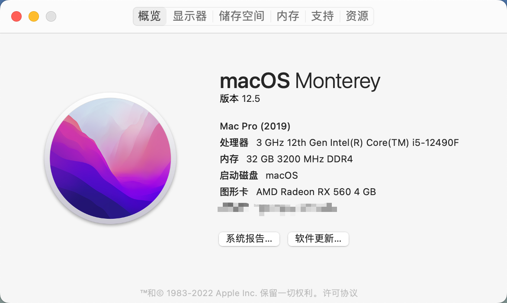
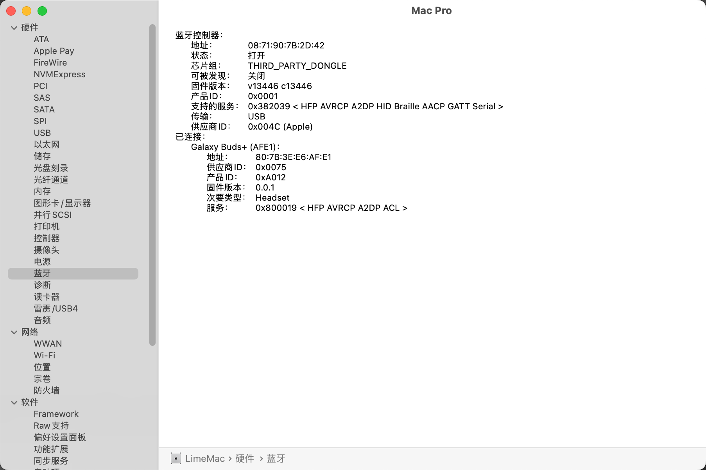
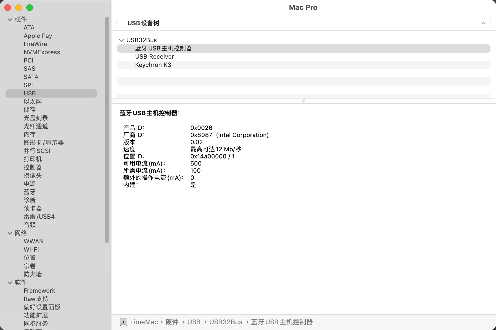
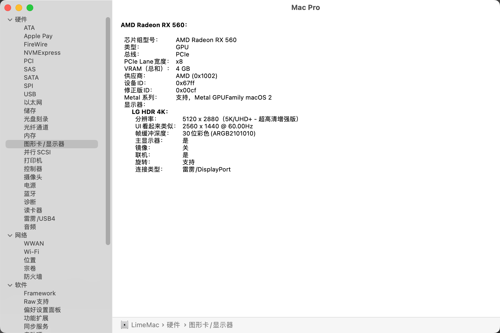
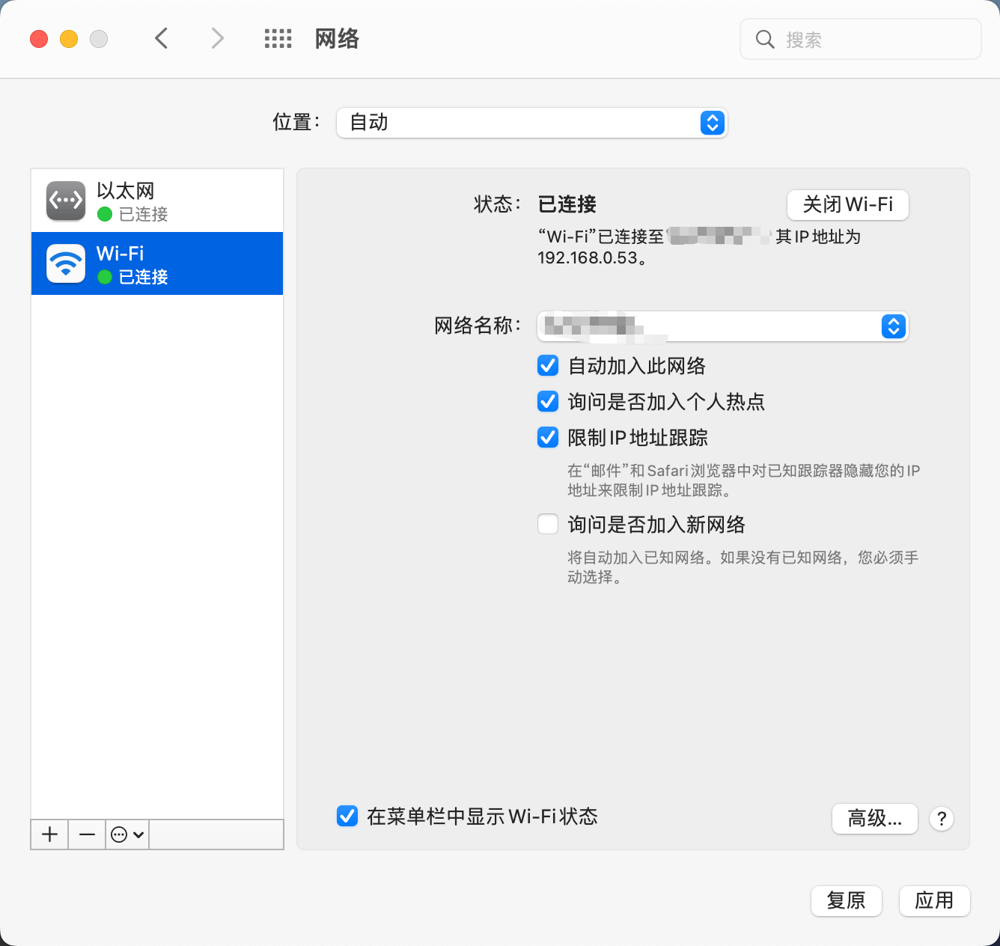
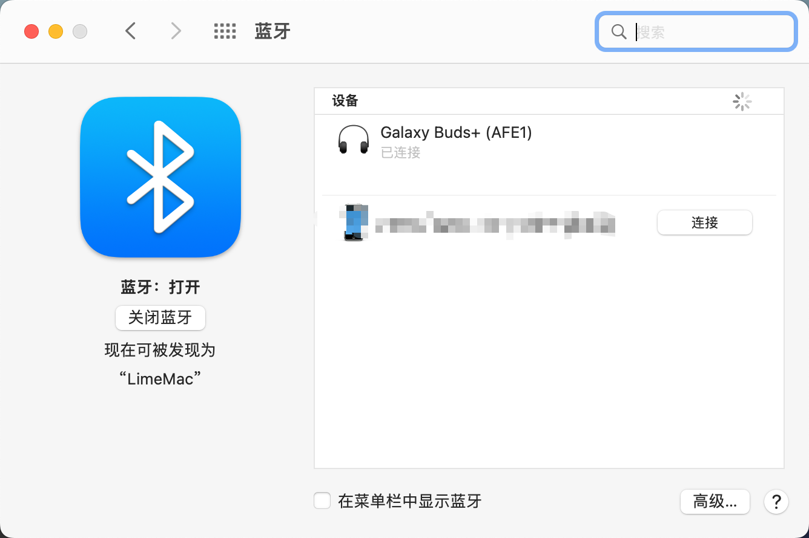
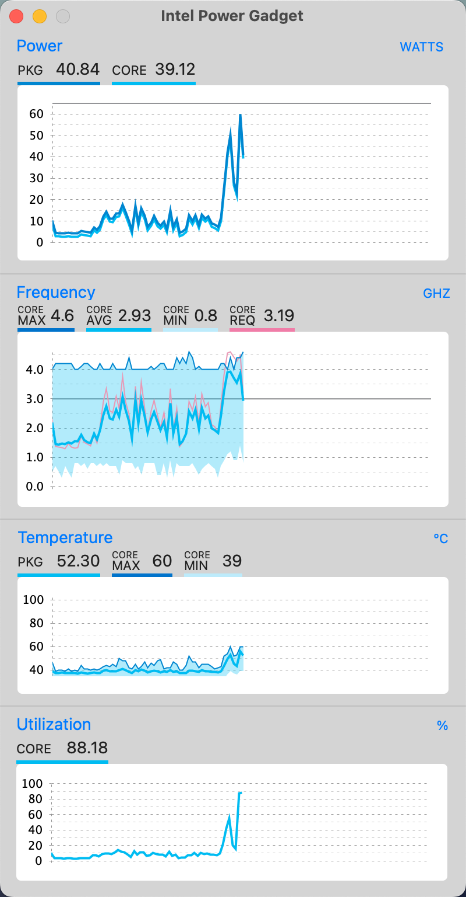

# Hackintosh MAXSUN(铭瑄) H610-ITX i5 12490F RX560
适用于 铭瑄 MS-H610-ITX + 12490F + RX560 的 OpenCore 0.9.6 黑苹果引导文件，机型 MacPro7,1  
OpenCore 0.9.6 for MAXSUN MS-H610-ITX + i5 12490F + RX560  

## 当前系统版本（Current OS Version）
macOS Sonoma

## 下载（Download）
[macOS Sonoma 14.0.x ~ 14.3.x EFI](https://github.com/LimeVista/Hackintosh-H610-12490F-AX201/releases/tag/14.100.1) 
[macOS Ventura EFI](https://github.com/LimeVista/Hackintosh-H610-12490F-AX201/releases/tag/13.9.2.1)  
[macOS Monterey EFI](https://github.com/LimeVista/Hackintosh-H610-12490F-AX201/releases/tag/12.8.2.1)  

## 本机配置（Hardware）
|  配置（Hardware）   | 型号（Model）  |
|  ---- | ----  |
| 处理器（CPU） | Intel i5 12490F |
| 主板（Mainboard） | MAXSUN MS-H610-ITX |
| 显卡（GPU）| 迪兰恒进（Dataland） RX560 X-Serial |
| 内存（RAM）| 光威天策 16G DDR4 3200MHz * 2 |
| 硬盘（SSD）| SanDisk Ultra 3D NVMe 1TB |
| WiFi + BT | Intel AX201 |

## 功能 （Functions）
* ✅ 声卡（Audio） 
* ✅ USB
* ✅ 无线网络（WiFi）
* ✅ 蓝牙（Intel Bluetooth）
* ✅ RX 560
* ✅ CPU 睿频正常（CPU Boost）
* ✅ 有线网络（LAN）
* 🚧 隔空投送，不稳定，仅USB 模式稳定（AirDrop，Unstable，USB mode stable only）
* ❌ 随航，需要核显，USB模式可以开启，但是黑屏（SideCar，need iGPU, black screen）

## 备注（Additional）
请自行生成三码  
Please generate the serial number manually  

## 预览（Preview）

## 智能寻址显存技术（Resize Bar Support）
如果 主板开启了 Resize Bar Support，需要修改 `Booter >> Quirks >> ResizeAppleGpuBars` 参数  
If Resize Bar Support enabled, see `Booter >> Quirks >> ResizeAppleGpuBars`

### ResizeAppleGpuBars（中文）
类型：plist 整数  
默认值：-1  
描述：适用于 macOS 的 GPU 智能寻址显存技术控制参数。  

这个 Quirk 将 MacOS 的 GPU PCI BAR 大小减少到指定的值，如果不支持的话，则更低。指定的值遵循 PCI Resizable BAR 规则。虽然 MacOS 支持理论上的1GB最大值。实际上，所有非默认值可能无法正常工作。由于这个原因，这个 Quirk 的唯一支持值是最小的 BAR 大小，即 0。 使用 -1 来禁用这个 Quirk。  

出于开发的目的，可以冒险尝试其他数值。考虑具有 2 个 BAR 的 GPU。
* BAR0 支持从 256MB 到 8GB 的大小。它的值是 4GB。
* BAR1 支持从 2MB 到 256MB 的大小。它的值是 256MB。

例 1：将 ResizeAppleGpuBars 设置为 1GB，将 BAR0 改为 1GB，BAR1 保持不变。  
例 2：将 ResizeAppleGpuBars 设置为 1MB 将改变 BAR0 为 256MB，BAR0 为 2MB。  
例 3：将 ResizeAppleGpuBars 设置为 16GB，将不做任何改变。  

注：请参阅 ResizeGpuBars quirk 了解 GPU PCI BAR size 配置和有关该技术的更多详细信息。  

### ResizeAppleGpuBars (English)
Type: plist integer
Failsafe: -1
Description: Reduce GPU PCI BAR sizes for compatibility with macOS.

This quirk reduces GPU PCI BAR sizes for Apple macOS up to the specified value or lower if it is unsupported. The specified value follows PCI Resizable BAR spec. While Apple macOS supports a theoretical 1 GB maximum, in practice all non-default values may not work correctly. For this reason the only supported value for this quirk is the minimal supported BAR size, i.e. 0. Use -1 to disable this quirk.

For development purposes one may take risks and try other values. Consider a GPU with 2 BARs:
* BAR0 supports sizes from 256 MB to 8 GB. Its value is 4 GB.
* BAR1 supports sizes from 2 MB to 256 MB. Its value is 256 MB.

Example 1: Setting ResizeAppleGpuBars to 1 GB will change BAR0 to 1 GB and leave BAR1 unchanged.  
Example 2: Setting ResizeAppleGpuBars to 1 MB will change BAR0 to 256 MB and BAR0 to 2 MB.  
Example 3: Setting ResizeAppleGpuBars to 16 GB will make no changes.  

Note: See ResizeGpuBars quirk for general GPU PCI BAR size configuration and more details about the technology.  

## 致谢（Credits）
* [AppleALC](https://github.com/acidanthera/AppleALC)
* [BrcmPatchRAM](https://github.com/acidanthera/BrcmPatchRAM)
* [CPUFriend](https://github.com/acidanthera/CPUFriend)
* [IntelBluetoothFirmware](https://github.com/OpenIntelWireless/IntelBluetoothFirmware)
* [itlwm](https://github.com/OpenIntelWireless/itlwm)
* [Lilu](https://github.com/acidanthera/Lilu)
* [LucyRTL8125Ethernet](https://github.com/Mieze/LucyRTL8125Ethernet)
* [OpenCore](https://github.com/acidanthera/OpenCorePkg)
* [RadeonSensor](https://github.com/ChefKissInc/RadeonSensor)
* [RestrictEvents](https://github.com/acidanthera/RestrictEvents)
* [VirtualSMC](https://github.com/acidanthera/VirtualSMC)
* [WhateverGreen](https://github.com/acidanthera/WhateverGreen)

## 借鉴（Thanks）
* [Crack-DanShiFu](https://github.com/Crack-DanShiFu/Hackintosh-MAXSUN--H610ITX-I512400-rx560)
